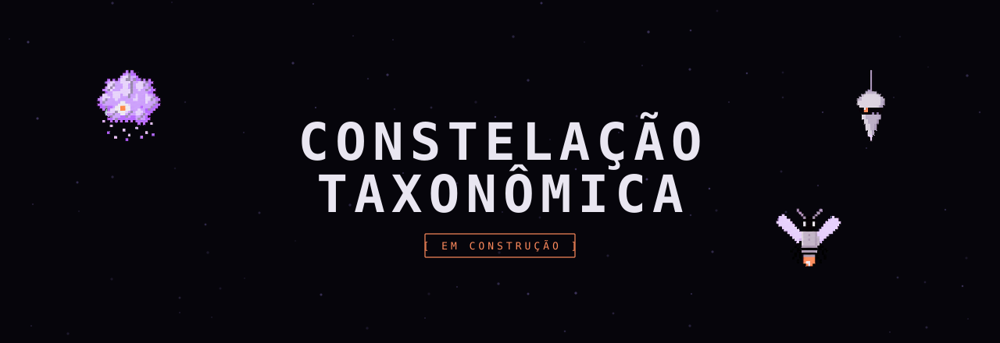

<a href="README.md">🇬🇧 English</a>

# Constelação Taxonômica

### ▶ [**Jogar no navegador →**](https://whatevertr.github.io/jogo-taxonomia/)

Um joguinho de navegador sobre **organizar contexto em taxonomias**. Você arrasta conceitos e os conecta sob o grupo certo, montando uma árvore de classificação. É o [Constellation Method](https://github.com/whatevertr/constellation-method) em jogo, basicamente: a habilidade de pôr informação solta na estrutura certa, treinada fase a fase.

> **Status.** Em construção. Esta é a **Onda 1**: sete fases jogáveis, do concreto às distinções epistêmicas. Mais fases (e um motor mais fundo) vêm depois pq eu sou CLT e não tenho muito tempo livre rsrs.

## Jogar

**[Jogue agora em whatevertr.github.io/jogo-taxonomia](https://whatevertr.github.io/jogo-taxonomia/)** — aperte **JOGAR**. Sem instalar, sem servidor. (Prefere offline? Clone o repo e abra o `index.html` local; funciona sem servidor.)

- **Arraste** um conceito e **solte sobre** outro para conectar.
- Solte no vazio para só **mover**; **duplo clique** desconecta.
- As **dicas** vêm de três personagens (a Tríade), cada uma no seu registro, e **custam pontos**.
- **DESISTIR** resolve a fase mas zera a pontuação.
- Troque **claro / escuro** quando quiser.

**Pontuação:** cada fase vale 100, menos 20 por dica usada, zero se desistiu.

## As fases (Onda 1)

Do concreto ao método:

1. Animais (uma árvore de taxonomia)
2. Tipos de dado (número, texto, data)
3. Tipos de análise
4. Fato vs opinião
5. Os 5 porquês (uma cadeia causal)
6. Regra vs piso epistêmico
7. Manual vs informação

## Tecnologia

- **HTML5 Canvas puro.** Sem framework, sem build, sem dependências.
- **Arquivo único autocontido** por página. Sprites embutidos; nada é buscado em runtime.
- **Ordered dithering** (Bayer 4x4) no fundo; nós sólidos em pixel por cima.
- Asserções no boot protegem as invariantes do motor. Respeita `prefers-reduced-motion`. Dois temas.

Feito com apoio de IA, usando o Constellation Method para manter o contexto coerente ao longo de muitas sessões.

## Licença

Três licenças (ver [`LICENSE`](LICENSE)):

- **Código** (o motor): CC BY 4.0.
- **Conteúdo** (puzzles, texto das fases, docs): CC BY 4.0.
- **Arte da marca** (a identidade NUD, os personagens da Tríade, as marcas): proprietário, todos os direitos reservados, não licenciado para reuso.

© 2026 Thainá Ramos (Nud by Whatevertr).
